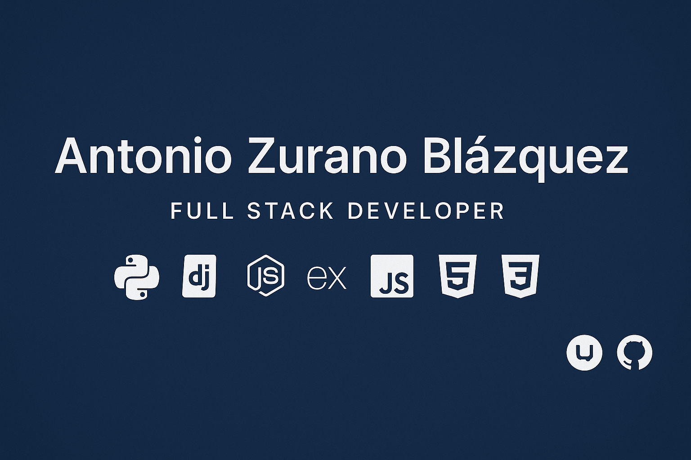

## 👋 ¡Hola! Soy Antonio Zurano Blázquez

## 👨‍💻 Sobre mí

💻 Desarrollador **Full Stack** apasionado por crear soluciones web escalables, optimizadas y de alto rendimiento. Trabajo tanto en el frontend como en el backend, aplicando buenas prácticas de desarrollo y herramientas modernas.

🛠️ Experiencia con **Node.js**, **Express.js**, **Python**, **Django**, **React**, y **Vue.js**, desarrollando APIs, interfaces atractivas y sistemas robustos.

🧱 Trabajo con bases de datos como **MySQL**, **SQL Server** y **MongoDB**, **SQLite** usando contenedores **Docker** para desplegar entornos aislados y productivos.

🎯 Me enfoco en la mejora continua, la formación constante y la entrega de productos con impacto real en los usuarios.

📚 Actualmente, me encuentro cursando el [Máster en Desarrollo Web Full Stack y Blockchain](https://www.conquerblocks.com/master-desarrollo-web-full-stack).

---

## 🧰 Stack Tecnológico

<!-- Fila 1 -->

 

<!-- Fila 2 -->

 

<!-- Fila 3 -->

 

## 🚀 Proyectos Destacados

### [🌐 Portfolio Website](https://dev.antoniozurano.com)

Mi sitio web personal donde muestro mis proyectos, habilidades y trayectoria. Diseñado desde cero y alojado en un servidor propio.

> **Stack:** HTML, CSS, JavaScript, Git, VPS

---

### [Garbi Contraincendios](https://www.garbicontraincendios.es)

Página web empresarial dedicada a la concienciación sobre sistemas contra incendios. Implementada con WordPress y soluciones personalizadas.

> **Stack:** WordPress, HTML, CSS, JavaScript

---

### [Trofeos Zurano](https://www.trofeoszurano.com)

Catálogo online de trofeos y medallas, con opción de descarga de catálogos PDF mediante registro.

> **Stack:** WordPress, HTML, CSS, JavaScript, PHP

---

### [Esther Moreno Psicóloga](https://www.esthermorenopsicologia.com)

Web profesional para una psicóloga independiente, con sistema de reservas online y diseño SEO optimizado.

> **Stack:** WordPress, HTML, CSS, JS, plugins

---

## 📄 Descarga mi CV

---

## 📫 Contacto

  
  

  
  

---

✨ ¡Estoy abierto a nuevas colaboraciones y proyectos! 🚀
