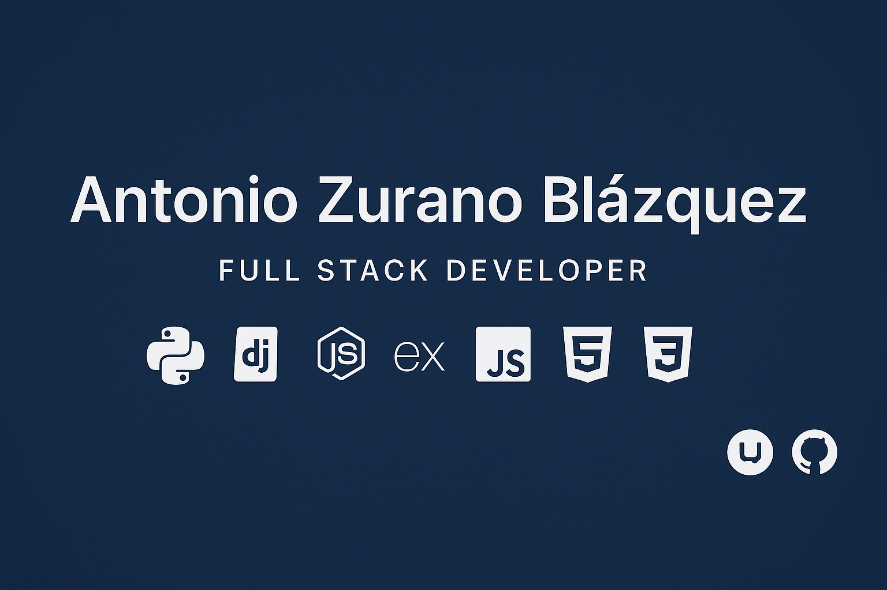

## 👋 ¡Hola! Soy Antonio Zurano Blázquez

## 👨‍💻 Sobre mí

💻 Desarrollo aplicaciones backend y herramientas de automatización con Python. Me centro en convertir procesos manuales y necesidades empresariales en soluciones mantenibles, probadas y desplegables

🛠️ Experiencia con **Python**, **Django**, **JavaScript**, **TypeScript**, **Astro**, **Node.js**, **Express.js**,   **React** y **Vue.js**, desarrollando APIs, aplicaciones empresariales e interfaces orientadas a resolver problemas reales.

🧱 Trabajo con bases de datos como **MySQL**, **PostgreSQL**, **SQL Server**, **MongoDB** y **SQLite**. También utilizo **Docker**, **Git**, **GitHub** y servidores Linux/Windows para preparar entornos de desarrollo y producción.

🎯 Me enfoco en la mejora continua, la formación constante y la entrega de productos con impacto real en los usuarios.

📚 Actualmente, me encuentro cursando el [Máster en Desarrollo Web Full Stack y Blockchain](https://www.conquerblocks.com/master-desarrollo-web-full-stack).

---

## 🧰 Stack Tecnológico

  <!-- Fila 1: Frontend -->

  

    
  

  <!-- Fila 2: Backend -->

  

    
  

  <!-- Fila 3: Bases de datos e infraestructura -->

  

    
  

  <!-- Fila 4: Control de versiones -->

  

    
  

  <!-- Fila 5: Herramientas de inteligencia artificial -->

 

## 🚀 Proyectos Destacados

### [📄 SeparadorNominas](https://github.com/AntonioZurano/SeparadorNominas)

Aplicación de escritorio para Windows que permite separar, reconocer, agrupar y clasificar las páginas de un PDF de nóminas.

Todo el procesamiento se realiza localmente, sin subir documentos ni datos personales a servicios externos. El proyecto incluye pruebas, documentación técnica, control de versiones, gestión de errores y un flujo Git basado en ramas de desarrollo, funcionalidades y correcciones.

> **Stack:** Python, Tkinter, pypdf, pytest, Git, PowerShell, Windows

---

### [💰 CashFlow Control — Caso de estudio](https://github.com/AntonioZurano/cashflow-control-case-study)

Aplicación fullstack para registrar, clasificar y analizar los movimientos de tesorería de una empresa. Incluye gestión de ingresos y gastos, categorías, filtros, exportaciones, dashboards, autenticación, control de acceso por roles y copias de seguridad.

He desarrollado tanto el frontend como el backend, además de la estructura de la base de datos, el despliegue en red local y el flujo de trabajo con Git.

El código fuente se mantiene en un repositorio privado por tratarse de una herramienta interna. El repositorio público documenta la arquitectura, las decisiones técnicas y el trabajo realizado utilizando exclusivamente información ficticia.

> **Stack:** Node.js, Express, SQLite, JavaScript, HTML, CSS, Chart.js, Git, PowerShell

---

### [🏢 Zurano y Blázquez](https://zuranoyblazquez.com)

Web corporativa desarrollada con Astro y TypeScript para presentar servicios tecnológicos dirigidos a autónomos, profesionales y pequeñas empresas.

Incluye diseño responsive, modo claro y oscuro, contenido en español e inglés, blog, SEO técnico, formularios de contacto y documentación legal adaptada al proyecto.

La aplicación está versionada con Git y GitHub y se despliega mediante un flujo CI/CD en un servidor VPS administrado con Plesk.

> **Stack:** Astro, TypeScript, JavaScript, HTML, CSS, GitHub, CI/CD, Plesk, VPS

---

### [🏠 DOMUS — Plataforma inmobiliaria](https://github.com/AntonioZurano/DeployDomus)

Proyecto final desarrollado en equipo durante el Bootcamp Full Stack de Nuclio Digital School.

DOMUS es una plataforma para agentes inmobiliarios que permite publicar propiedades en venta o búsqueda, aplicar filtros, gestionar usuarios y facilitar la colaboración entre profesionales.

El proyecto integra una interfaz desarrollada con React, un backend basado en Node.js y Express y una base de datos MongoDB.

> **Stack:** React, Material UI, Node.js, Express, MongoDB, Mongoose, Git

---

### [🌐 Portfolio Website](https://dev.antoniozurano.com)

Sitio web personal donde muestro mi trayectoria, habilidades y proyectos de desarrollo. Diseñado desde cero y alojado en un servidor propio.

> **Stack:** HTML, CSS, JavaScript, Git, VPS

---

### [🔥 Garbi Contraincendios](https://www.garbicontraincendios.es)

Página web empresarial dedicada a la presentación de servicios y soluciones de protección contra incendios.

Implementada con WordPress y soluciones personalizadas, incluyendo diseño responsive, formularios, contenidos empresariales, mantenimiento técnico, alojamiento y administración del dominio.

> **Stack:** WordPress, HTML, CSS, JavaScript, PHP, Plesk, Cloudflare

---

### [🏆 Trofeos Zurano](https://www.trofeoszurano.com)

Catálogo online de trofeos, copas, medallas y productos personalizados, con sistema de registro para acceder a la descarga de catálogos PDF.

También realizo su mantenimiento técnico, actualizaciones, alojamiento, copias de seguridad y administración del dominio.

> **Stack:** WordPress, HTML, CSS, JavaScript, PHP, Plesk, Cloudflare

---

## 📄 Descarga mi CV

---

## 📫 Contacto

  
  

  
  

---

✨ ¡Estoy abierto a nuevas colaboraciones y proyectos! 🚀
